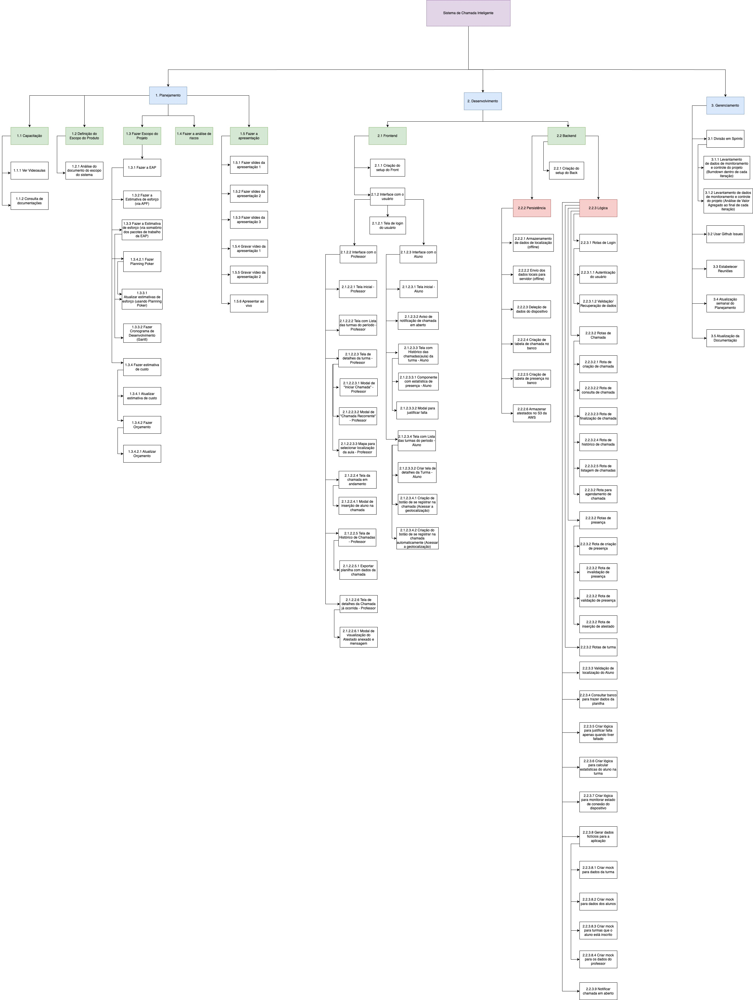

# Projeto Chamada Inteligente 

O projeto Chamada Inteligente trata-se de um sistema desenvolvido na disciplina de Gerência de Projeto de Software - UFF para gerenciamento de uma chamada/lista de presença que está sendo desenvolvido para fins de um requisito parcial de avaliação, assim como concorre para ser implementado na Superintendência de Tecnologia da Informação (STI/UFF). 

* **Objetivo do projeto**:
  Fomentar o aprendizado de novas arquiteturas, tecnologias e métodos de desenvolvimento de produtos digitais através da experimentação e aplicação de conceitos aprendidos em aula.

* Data: 05/11/2023
* Versão atual: 1.0 

## 1. Pré-Requisitos

* Windows 10 ou 11.
  * [Flutter 3.13.4](https://docs.flutter.dev/get-started/install)
  * [Android Studio](https://developer.android.com/studio)
  * [XCode](https://developer.apple.com/xcode/)
  * [Visual Studio Code](https://code.visualstudio.com/)
  * Android SDK Command Lines - Obtido através do Android Studio
  * Android SDK Platform Tools 34.0.4 - Obtido através do Android Studio
  * Dart Plugin - Obtido através do Android Studio
  * [Dart SDK](https://dart.dev/get-dart) - (_Para o Dart Plugin_) Facilita o entendimento do projeto pela IDE 


## 2. Instruções de construção, execução e uso da API

Antes de executar, certifique-se de que as variáveis de ambiente do Android SDK foram devidamente configuradas no Sistema Operacional. 

* Variáveis de ambiente.
  * `ANDROID_HOME` : **\Users\YourUser\AppData\Local\Android\Sdk
  * `PATH` : **\flutter\bin
             %ANDROID_HOME%\tools
             %ANDROID_HOME%\tools\bin
             %ANDROID_HOME%\platform-tools

Obtenha o diagnóstico da configuração antes da execução do projeto a partir da seguinte linha de comando:

```
flutter doctor
```

Recomenda-se utilizar este modo de compilação para implantar o front-end em ambientes externos de produção, desenvolvimento, controle de qualidade e etc. A compilação do pacote pode ser feita através do comando:

```
flutter run -d chrome --web-browser-flag "--disable-web-security"
```

## 3. Testes Unitários do Projeto

## 4. Links Relacionados
Repositório referente ao Backend do Projeto: https://github.com/Taisbruno/chamada-inteligente-uff-back

Link do Github Issues do Projeto: https://github.com/users/Taisbruno/projects/1

## 5. Imagem da EAP


